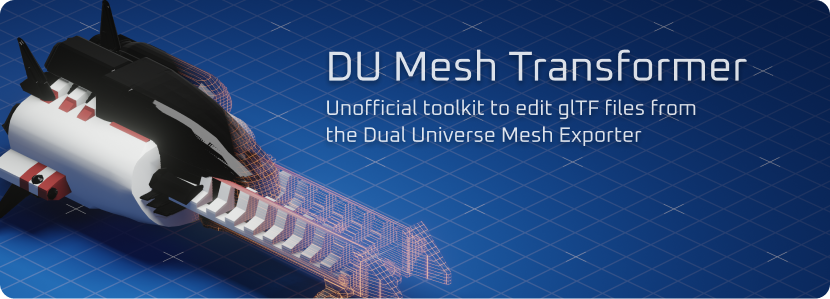
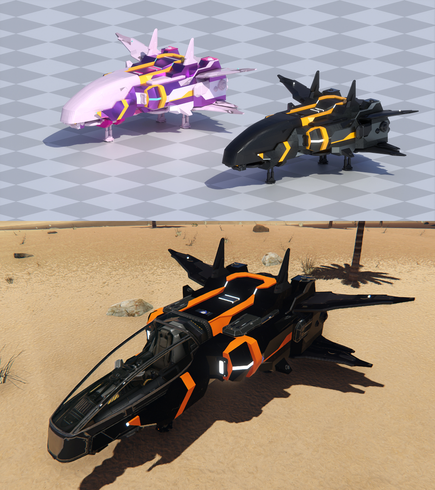

# Mesh Transformer for Dual Universe (du-gltf)
🎨 Enhances glTF files exported by Dual Universe's Mesh Exporter so they have proper colors and textures applied to them

## What it is and what it can (or can't) do

This project is mainly intended to allow players who exported their in-game constructs as glTF to apply certain corrections to their meshes so they can be properly imported into 3D modelling software, such as Blender, etc.

The main reason for this is that, by default, the game's official Mesh Exporter seems to export the materials with missing textures and incorrect color/metallic/roughness factors. We are able to read those files and reconstruct the meshes with the right material data (which, of course, requires having the game installed), export them as new files.

We also do some extra processing on the meshes, reconstructing UV maps (for texture application) similar to how the game does it (based on the object coordinates) and also try to isolate elements from the rest of the voxel mesh, allowing for those element meshes to have some other material applied to them.

A limitation we have is that elements are not fixed automatically, as those have completely separate sets of meshes/textures/UVs, etc, and we don't have access to those files, nor have any metadata to properly apply the textures or position the meshes.

Here's an example of how the originally exported mesh looks like, compared to the processed mesh, and the in-game construct:



Some things such as colors may not look 100% identical to what they do in-game, this is mainly due to differences between the game's and other software rendering engines, environments, etc.

## Installation and Usage

Install the command-line utility by running `npm i -g @wolfe-labs/du-gltf`.

After installing, run `du-gltf` to check if the installation was successful. You need to provide your exported glTF file as the first parameter, like this:

```sh
du-gltf "path/to/my.gltf"
```

This assumes you have the game installed at its default ProgramData location, if you don't, you also need to provide a path as the second parameter:

```sh
du-gltf "path/to/my.gltf" "C:/path/to/DualUniverse"
```

You can also enable detailed debugging information of the process by setting the `DEBUG` environment variable, like this Powershell example:

```ps1
$env:DEBUG; du-gltf "path/to/my.gltf" "C:/path/to/DualUniverse"
```

### Installing as a Node library

You can also create your own wrapper around the package and customize all kind of settings yourself.

To do so, install it into your Node project with `npm i --save @wolfe-labs/du-gltf` and follow the example below to get started:

```js
// You can also use the module syntax:
// import DuMeshTransformer from '@wolfe-labs/du-gltf';
const DuMeshTransformer = require('@wolfe-labs/du-gltf').default;

// This function is a wrapper so we can use async/await
async function convert(file) {
  // Loads our mesh
  const meshTransformer = await DuMeshTransformer.fromFile('mesh.gltf');

  // Sets the game directory (optional)
  meshTransformer.setGameInstallationDirectory('C:/games/DualUniverse');

  // Shows debug information
  meshTransformer.events().on(EventType.WARNING, message => console.warn('WARNING:', message));
  meshTransformer.events().on(EventType.TRANSFORM_START, () => console.log('Model processing started!'));
  meshTransformer.events().on(EventType.TRANSFORM_FINISH, () => console.log('Model processing finished!'));
  meshTransformer.events().on(EventType.TRANSFORM_NEXT, () => console.log(''));
  meshTransformer.events().on(EventType.DEBUG, message => console.log(message));

  // Queues a list of transforms we'll want to do and triggers processing (upon saving)
  await meshTransformer
    .withBaseColors()
    .withTextures()
    .withUvMaps()
    .withHdrEmissive()
    .withSeparatedElements()
    .saveToFile('mesh-output.glb');
}

// Runs the actual conversion
convert('my-file.gltf')
  .then(() => console.log('File processed!'));
```